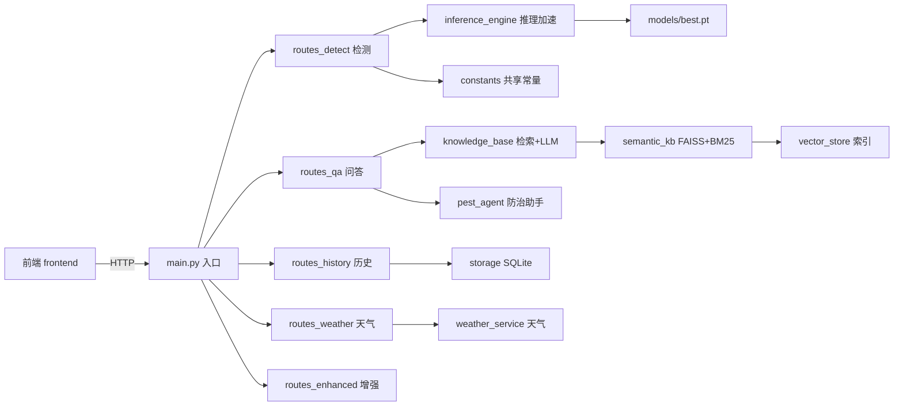

# 🌲 项目完整目录树与文件作用说明

> 生成时间：2026-07-31（2026-08-04 更新：新增 Docker / 压测 / 小目标 / 多害虫等）
> 用途：快速了解项目全貌、论文“系统实现”章节素材
> 🔑 快速指南：项目分 6 大块 —— 🚀核心运行 / 🎓模型训练 / 🐳部署 / 🔬工具脚本 / 📖文档 / 🧹可清理。**核心只有 backend+frontend+knowledge**，其余都是辅助。

---

## 一、完整目录树

```
post-detect-master/
│
├── 📄 根目录文件
│   ├── README.md                     # 项目简介与快速开始
│   ├── DEPLOY_SERVER.md              # 阿里云服务器部署指南
│   ├── deploy_server.sh              # 服务器一键部署脚本
│   ├── start.sh / start.ps1          # 本地启动脚本（Windows/Linux）
│   ├── requirements.txt              # 主依赖（含 CPU PyTorch 固定版）
│   ├── requirements-server.txt       # 服务端基础依赖
│   ├── requirements-optional.txt     # 可选依赖（FAISS/sentence-transformers/LLM）
│   ├── requirements-torch-cpu.txt    # CPU 版 PyTorch 固定版本
│   ├── train_distill.py              # ⭐ 知识蒸馏训练脚本（教师→学生）
│   ├── yolo11n.pt                    # 原始 YOLOv11n 预训练权重
│   ├── test_model.py                 # 模型加载自检脚本
│   ├── .env                          # 云端大模型配置（LLM Key，勿上传）
│   └── .env.example                  # 环境变量模板
│
├── 🖥 backend/                       # FastAPI 后端（核心）
│   ├── main.py                       # ⭐ 应用入口（精简）：创建应用/中间件/后台加载/挂载路由/健康检查
│   ├── routes_detect.py              # 路由：/detect/* 检测（含开放集识别）
│   ├── routes_qa.py                  # 路由：/qa/* 问答（普通+流式+多害虫）
│   ├── routes_history.py             # 路由：/history/* 历史与统计
│   ├── routes_weather.py             # 路由：/weather/* 天气与预警
│   ├── routes_enhanced.py            # 路由：/enhanced/* 增强模块状态
│   ├── config.py                     # 路径配置（目录常量）
│   ├── state.py                      # 全局运行时状态（模型/引擎/Agent）
│   ├── schemas.py                    # Pydantic 数据模型（请求/响应）
│   ├── constants.py                  # 共享常量（16 类名单/阈值/限制）
│   ├── inference_engine.py           # ⭐ 推理引擎：CLAHE+伪装增强+感知哈希缓存
│   ├── knowledge_base.py             # 知识库检索 + LLM 调用（含流式）
│   ├── semantic_kb.py                # 语义知识库（FAISS 向量检索 + BM25）
│   ├── pest_agent.py                 # ⭐ AI 防治助手：诊断报告生成
│   ├── weather_service.py            # 天气获取 + 虫害风险等级评估
│   ├── storage.py                    # ⭐ SQLite 历史存储（检测/问答/统计）
│   ├── models/
│   │   ├── best.pt                   # ⭐ 蒸馏后模型（mAP 74.6%，含教师封装）
│   │   └── best_old_v11n.pt          # 旧模型备份（mAP 49.4%）
│   ├── results/                      # 检测结果图输出目录
│   ├── uploads/                      # 用户上传临时目录
│   └── pest_data.db                  # SQLite 数据库（运行自动生成）
│
├── 🎨 frontend/                      # Web 前端（移动优先）
│   ├── templates/
│   │   ├── index.html                # 主页面（识别+问答界面）
│   │   └── loading.html              # 品牌加载页（入场动画）
│   └── static/
│       ├── css/style.css             # ⭐ 全部样式（设计系统/毛玻璃/进度条）
│       ├── js/app.js                 # ⭐ 全部前端逻辑（检测/问答/历史面板）
│       └── img/logo.png              # 校徽/Logo
│
├── 📚 knowledge/                     # 农业知识库
│   ├── pests/                        # 16 类害虫 JSON（332 条知识）
│   │   ├── rice_leaf_roller.json     # 稻纵卷叶螟
│   │   ├── brown_plant_hopper.json   # 褐飞虱
│   │   ├── small_brown_plant_hopper.json  # 灰飞虱（最难识别）
│   │   └── ...（共 16 个）
│   └── vector_store/                 # ⭐ 向量检索索引
│       ├── faiss.index               # FAISS 索引（80 块）
│       ├── embeddings.npy            # 向量矩阵
│       └── index.json                # 分块元数据
│
├── ⚙️ scripts/
│   └── enhance_knowledge_base.py     # 知识库增强生成脚本
│
├── 📖 docs/                          # 项目文档（论文素材）
│   ├── README.md                     # 文档导航
│   ├── design-overview.md/.html      # 系统设计文档（三大增强模块）
│   ├── learning-notes.md/.html       # 学习笔记
│   ├── weather-implementation.md     # 天气模块实现细节
│   ├── comprehensive-summary.md      # 项目综合总结
│   ├── K-P01.md                      # 技术要点记录
│   ├── model-training-journey.md     # ⭐ 训练全记录（含报错排障）
│   ├── GPU_TRAINING_GUIDE.md         # GPU 租用指南
│   ├── train_yolov11s_colab.ipynb    # Colab 训练笔记本
│   ├── review-notes-training-deploy.md  # ⭐ 完整复习笔记
│   └── paper-experiment-plan.md      # ⭐ 论文实验设计规划
│
├── 📦 post-detect-master/            # 嵌套副本（部署备份，可忽略）
├── .venv/                            # Python 虚拟环境
└── .git/  .claude/  .vscode/  Desktop/   # 开发环境文件
```

---

## 二、核心文件作用详解（按重要度）

### ⭐⭐⭐ 后端核心（论文"方法实现"对应）

| 文件 | 作用 | 论文对应 |
|------|------|---------|
| `backend/main.py` | FastAPI 入口（精简 ~170 行）：创建应用/中间件/静态资源、后台加载模型、挂载 5 个路由模块、健康检查 | 系统架构 |
| `backend/routes_detect.py` | 检测路由 `/detect/*`：图片/Base64/增强检测 + 文件校验 + 开放集识别 | 系统架构 + 开放集方法 |
| `backend/routes_qa.py` | 问答路由 `/qa/*`：普通/流式问答、多害虫分别回答、知识库状态 | 问答系统 |
| `backend/config.py` + `state.py` + `schemas.py` | 路径配置 / 全局运行时状态 / Pydantic 模型 | 工程实现 |
| `backend/inference_engine.py` | 推理引擎：CLAHE 光照增强、**伪装色增强**（HSV 绿色分析+条件触发+纹理增强）、**感知哈希缓存**（LRU） | 预处理方法 + 部署优化 |
| `backend/pest_agent.py` | AI 防治助手：`DiagnosisReport`（评估/分析/建议/预防/风险），LLM 增强诊断 + 规则兜底 | 认知层方法 |
| `backend/semantic_kb.py` | 语义知识库：FAISS 向量检索 + BM25 混合检索，80 个知识块 | 知识层方法 |
| `backend/knowledge_base.py` | 知识检索 + LLM 调用（OpenAI 兼容接口，流式/非流式） | 问答系统 |
| `backend/storage.py` | SQLite 存储：检测/问答历史 + 统计接口 | 数据闭环 |

### ⭐⭐⭐ 前端（论文"感知体验"对应）

| 文件 | 作用 | 亮点 |
|------|------|------|
| `frontend/static/js/app.js` | 全部前端逻辑：检测流程、流式问答、历史面板、天气联动、指数进度条 | ⭐ 指数反函数时间表 `t_i=-τln(1-i/N·P_max)` |
| `frontend/static/css/style.css` | 设计系统：蓝绿配色、毛玻璃、稻穗金、层次阴影 | UI 美观度 |

### ⭐⭐ 知识库（数据资产）

| 文件 | 内容 |
|------|------|
| `knowledge/pests/*.json` | 16 类害虫 ×（特征/症状/发生规律/防治/问答），共 332 条 |
| `knowledge/vector_store/` | 预生成的 FAISS 索引（80 块，含向量） |

### ⭐⭐ 训练（论文"方法-数据"对应）

| 文件 | 作用 |
|------|------|
| `train_distill.py` | 蒸馏训练：教师 v11m → 学生 v11n，`dis_loss` 特征蒸馏 |
| `yolo11n.pt` | 预训练基线 |
| `backend/models/best.pt` | ⭐ 最终模型（mAP 74.6%） |

---

## 三、数据流全景（论文"系统架构图"素材）

```
用户上传图片
    │
    ▼
backend/main.py ── /detect/image
    │
    ▼
inference_engine.py
    ├─ CLAHE 光照增强
    ├─ 伪装色增强（绿色>10% 才触发）
    └─ 感知哈希缓存（命中直接返回）
    │
    ▼
YOLO 蒸馏模型（best.pt）
    ├─ 16 类检测框
    └─ 开放集识别（低置信度→未知提示）
    │
    ▼
knowledge_base.py ── /qa/ask
    ├─ FAISS 语义检索 + BM25
    └─ LLM 生成防治建议（DeepSeek）
    │
    ▼
storage.py ── SQLite 记录历史 → 统计
    │
    ▼
前端展示：结果图 + 检测列表 + 问答 + 天气预警
```

---

## 四、六大分类一览（2026-08-04 更新）

| 分类 | 目录/文件 | 作用 | 重要性 |
|------|----------|------|--------|
| 🚀 **核心运行** | `backend/` + `frontend/` + `knowledge/` + `start.*` + `requirements.txt` | 线上真正跑的系统 | ⭐⭐⭐ |
| 🎓 **模型训练** | `train_distill.py` / `train_ablation.py` / `train_small_object.py` / `yolo11n.pt` | 论文与离线训练（GPU 上跑） | ⭐⭐ |
| 🐳 **部署** | `Dockerfile` / `docker-compose.yml` / `.dockerignore` / `deploy_server.sh` / `DEPLOY_SERVER.md` / `requirements-*.txt` | 服务器一键部署 | ⭐⭐ |
| 🔬 **工具脚本** | `scripts/`（增强/多尺度/诊断 3 个）+ `benchmark/`（并发压测） | 调试·增强·评测 | ⭐ |
| 📖 **文档** | `docs/`（19 个）+ `README.md` | 论文素材与说明 | ⭐ |
| 🧹 **可清理** | 见第五节 | 冗余，建议删除 | — |

### 后端模块依赖关系



## 五、🧹 可清理清单（帮项目减负）

| 项目 | 位置 | 说明 | 建议 |
|------|------|------|------|
| 嵌套副本 | `post-detect-master/`（根目录内） | 整份项目又复制了一遍（含 .venv/.git），纯冗余 | 🗑 删除 |
| 空目录 | `Desktop/` | 空文件夹 | 🗑 删除 |
| 临时自检脚本 | `test_model.py` | 服务器调试用，路径写死 /root/pest-detect | 移入 scripts 或删除 |
| Python 缓存 | `__pycache__/` | 运行自动生成 | 清理（已 gitignore） |
| 文档备份 | `docs/*.zip`、`*.html` | design/learning 的 HTML/ZIP 备份 | 归档或删除 |
| 旧模型 | `backend/models/best_old_v11n.pt` | 旧 v11n 备份（49.4%） | 确认无用后删除 |
| 可选目录 | `.claude/` | Claude 配置 | 按需保留 |

---

## 六、全部文件作用速查表（2026-08-10）

> 按目录分组，逐一说明每个文件的作用。

### 根目录

**配置类**

| 文件 | 作用 |
|------|------|
| `.gitignore` | Git 忽略规则（模型/数据集/.env/运行时目录不上传） |
| `.gitattributes` | Git 换行符处理（统一 LF/CRLF） |
| `.env` | 本地环境变量：LLM 大模型配置（含密钥，不提交） |
| `.env.example` | `.env` 模板示例（公开可提交） |
| `.dockerignore` | Docker 构建排除清单（模型/数据集/文档不进镜像） |

**部署类**

| 文件 | 作用 |
|------|------|
| `Dockerfile` | Docker 镜像构建（CPU 推理，python:3.11 + 全依赖） |
| `docker-compose.yml` | 一键编排部署（端口/数据卷/健康检查/自恢复） |
| `deploy_server.sh` | 服务器传统方式一键部署脚本 |
| `DEPLOY_SERVER.md` | 阿里云服务器部署指南（传统方式） |
| `start.sh` / `start.ps1` | 本地启动脚本（Linux / Windows） |

**训练类**

| 文件 | 作用 |
|------|------|
| `train_distill.py` | 知识蒸馏训练（教师 v11m → 学生 v11n） |
| `train_ablation.py` | 论文消融对比（6 个模型统一超参训练+评估） |
| `train_small_object.py` | 小目标优化训练（imgsz 提高 + copy-paste 增强） |
| `yolo11n.pt` | YOLOv11n 预训练权重（5.4MB，训练用，未提交） |

**依赖/文档**

| 文件 | 作用 |
|------|------|
| `requirements.txt` | 主依赖（含 CPU 版 PyTorch 固定版本） |
| `requirements-server.txt` | 服务端基础依赖（FastAPI/opencv 等） |
| `requirements-torch-cpu.txt` | CPU 版 PyTorch 专用固定版本 |
| `requirements-optional.txt` | 可选增强依赖（FAISS/句向量/LLM/ONNX） |
| `README.md` | 项目简介与快速开始 |

### backend/

**入口**

| 文件 | 作用 |
|------|------|
| `main.py` | 应用入口（约 170 行）：创建 app、中间件、后台加载、挂载 5 个路由、健康检查 |

**路由**

| 文件 | 作用 |
|------|------|
| `routes_detect.py` | `/detect/*`：图片上传/Base64/增强检测 + 开放集识别 |
| `routes_qa.py` | `/qa/*`：普通/流式问答 + 多害虫分别回答 |
| `routes_history.py` | `/history/*`：检测/问答历史 + 统计 |
| `routes_weather.py` | `/weather/*`：实时天气 + 虫害风险预警 |
| `routes_enhanced.py` | `/enhanced/*`：语义库/Agent/推理引擎状态 |

**基础设施**

| 文件 | 作用 |
|------|------|
| `config.py` | 路径配置（模型/上传/结果/前端目录） |
| `state.py` | 全局运行时状态（模型/引擎/Agent，跨模块共享） |
| `schemas.py` | Pydantic 数据模型（请求/响应结构） |
| `constants.py` | 共享常量（16 类名单、置信度阈值、上传限制） |

**业务模块**

| 文件 | 作用 |
|------|------|
| `inference_engine.py` | 推理加速：CLAHE 增强 + 伪装色增强 + 感知哈希缓存 |
| `knowledge_base.py` | 知识检索 + LLM 调用（OpenAI 兼容，流式/非流式） |
| `semantic_kb.py` | 语义知识库：FAISS 向量 + BM25 混合检索 |
| `pest_agent.py` | AI 防治助手：生成诊断/分析/防治报告 |
| `weather_service.py` | 天气获取 + 按天气评估虫害风险 |
| `storage.py` | SQLite 历史存储（检测/问答/统计） |

**模型与运行时（未提交）**

| 文件 | 作用 |
|------|------|
| `models/best.pt` | 部署模型（蒸馏 v11n，279.6MB） |
| `models/best_old_v11n.pt` | 旧 v11n 备份（5.2MB） |
| `uploads/` / `results/` | 运行时临时上传 / 结果图目录（自动生成） |
| `pest_data.db*` | SQLite 数据库 + WAL 附属（运行自动生成） |

### frontend/

| 文件 | 作用 |
|------|------|
| `templates/index.html` | 主页面（识别 + 聊天问答界面） |
| `templates/loading.html` | 品牌加载页（入场动画） |
| `static/css/style.css` | 全部样式（设计系统/毛玻璃/按钮/进度条） |
| `static/js/app.js` | 全部前端逻辑（上传/检测/流式问答/多害虫/天气） |
| `static/img/logo.png` | 系统 Logo |

### knowledge/

| 文件 | 作用 |
|------|------|
| `pests/*.json`（16 个） | 16 类水稻害虫知识（特征/症状/发生/防治/问答） |
| `vector_store/faiss.index` | FAISS 向量索引（未提交，可重建） |
| `vector_store/embeddings.npy` | 知识块向量矩阵 |
| `vector_store/index.json` | 知识块元数据 |

### scripts/ + benchmark/

| 文件 | 作用 |
|------|------|
| `scripts/debug_detect.py` | 检测诊断：定位"识别不出"是阈值还是模型问题 |
| `scripts/multiscale_detect.py` | 多尺度/滑窗推理：小目标增强（离线高精度） |
| `scripts/enhance_knowledge_base.py` | 知识库增强生成脚本 |
| `scripts/test_model.py` | 模型加载自检（服务器用） |
| `benchmark/benchmark_concurrency.py` | 并发压测：对比 before/after 的 P95/吞吐 |

### docs/

| 目录 | 内容 |
|------|------|
| `design/`（6） | 设计文档、学习指南、项目结构、天气实现、总结、K-P01 |
| `training/`（6） | 训练记录、GPU 指南、环境搭建、复习笔记、Colab、Docker 部署 |
| `paper/`（4） | 论文大纲、实验设计、健壮性素材、小目标素材 |
| `_archive/`（5） | 旧报告 + 设计/学习笔记的 HTML/ZIP 备份 |
| `README.md` | 文档导航索引 |

### 隐藏/环境目录

| 目录 | 作用 |
|------|------|
| `.claude/` | 本地 AI 助手配置 |
| `.venv/` | Python 虚拟环境（依赖，不提交） |
| `.vscode/` | VS Code 编辑器配置 |
| `.git/` | Git 版本历史 |

---

*配合 `docs/paper/paper-experiment-plan.md` 使用。*
