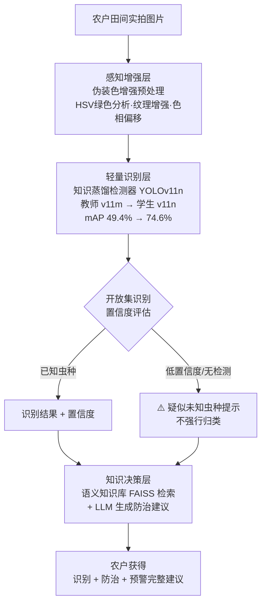

# 📄 论文实验设计规划 — 轻量化感知-认知协同水稻害虫诊断系统

> **目标期刊**：Computers and Electronics in Agriculture（中科院二区，看重应用 + 系统完整性）
> **核心范式**：以知识蒸馏为基座的"感知-认知协同"框架
> **用途**：论文实验设计清单 · 架构图 · 表格模板 · 行动路线

---

## 一、论文叙事框架（统一主线，避免"模块堆砌"）

<div style="background-color:#e8f5e9; padding:12px 16px; border-radius:8px; border-left:4px solid #4caf50;">

**一句话范式**：
> 面向**低资源农业场景**（CPU 部署、农户实拍、虫种多样）的**轻量化感知-认知协同**水稻害虫诊断系统：知识蒸馏提供 CPU 可用的检测基座，伪装色增强提升田间弱对比度鲁棒性，开放集识别避免未知虫种硬归类，语义知识库与大模型实现从"识别"到"决策"的闭环。

**三层架构（每个模块对应一个真实痛点）**：
</div>



```
痛点       →  技术模块      →  解决什么
看不清图   →  伪装色增强      →  田间弱对比度下"看得到"
认不准/慢  →  知识蒸馏        →  CPU 部署下"认得准还轻快"
认错/认不出 → 开放集识别      →  未知虫种"知道不知道"
不会防治   →  语义库 + LLM   →  从"识别"到"决策"闭环
```

---

## 二、数据集与实验基础（论文 Data 章节素材）

<div style="background-color:#e3f2fd; padding:12px 16px; border-radius:8px; border-left:4px solid #2196f3;">

| 项目 | 数值 | 论文用途 |
|------|------|---------|
| 数据集 | DST1794 | 16 类水稻害虫 |
| 图片总数 | 9,772 张 | — |
| 训练/验证/测试 | 6,994 / 1,890 / 887 | 严格划分说明 |
| 测试集背景图 | 423 张 | 鲁棒性（防误报） |
| 测试集害虫实例 | 605 个 | — |
| 输入分辨率 | 640×640 | 与部署一致 |

**必须补的**：
1. **各类别样本分布表**（尤其褐/白背/灰飞虱的样本数——少样本是 AP 低的客观原因，要主动分析）
2. **类不平衡分析**：飞虱三兄弟 AP 低 → 归因于"类间可分性 + 标注噪声"，用蝼蛄 AP 92.6% 佐证"模型没问题"
</div>

---

## 三、实验设计清单（🔴 最硬的需求）

### 实验 A：主检测器对比（对比实验，必须做）

**目的**：证明"蒸馏 v11n 在同等/更小体积下精度最优、速度不降"。

| 模型 | 参数量 | 备注 |
|------|--------|------|
| YOLOv8n | 3.2M | 上代 nano 基线 |
| YOLOv8s | 11.2M | 上代 small |
| YOLOv11n（未蒸馏） | 2.6M | **直接训练基线（关键对照）** |
| YOLOv11s | 9.4M | 更大模型对照 |
| YOLOv11m | 20M | 教师模型（参考上限） |
| **蒸馏 v11n（本文）** | 2.6M | 教师 v11m → 学生 v11n |

**统一配置**：同数据划分、同 imgsz=640、同 epoch、同优化器，保证公平。

**指标**：mAP@0.5、mAP@0.5:0.95、Precision、Recall、F1、Params、FLOPs、模型大小、CPU 延迟/GPU 延迟。

**预期故事**："2.6M 蒸馏模型达到 74.6% mAP，超过 9.4M 的 v11s，逼近 20M 教师——轻量化的胜利。"

### 实验 B：蒸馏方法对比（体现方法深度）

| 方法 | 原理 |
|------|------|
| 无蒸馏（直接训练） | 基线 |
| Logits/Soft 蒸馏（KD） | 教师软标签 KL 散度 |
| **特征蒸馏 + 软标签（本文）** | 中间特征 MSE + 软标签（`dis_loss`） |
| 关系蒸馏（可选） | 样本间关系保持 |

### 实验 C：消融实验（证明每个模块的贡献）

| 模块 | 去掉后的影响 |
|------|-------------|
| 知识蒸馏 | mAP 骤降（49.4 vs 74.6） |
| 伪装色增强 | 田间弱对比度图上的 AP 下降 |
| 开放集识别 | 未知虫种被错误归类（误报率上升） |
| 语义库 + LLM | 问答从"自然回答"退化为"模板拼接" |

### 实验 D：系统性能（CAE 特别看重）

- CPU 单张推理延迟、吞吐、内存占用
- 端到端延迟（上传→结果渲染）
- 7×24 稳定性（systemd 自启、崩溃恢复）

### 实验 E：问答质量评估（⭐ 差异化，别人没有）

准备 20-30 道农业问答（识别/防治/发生规律），对比三种模式，人工打分：

| 维度 | 纯知识库 | 知识库+LLM（本文） | 纯 LLM |
|------|---------|-------------------|--------|
| 准确性 | | | |
| 完整性 | | | |
| 农业专业性 | | | |
| 实用性 | | | |

### 实验 F：泛化测试（加分项）

用模型**没见过的真实稻田图片**测试（你本地/田间拍的），验证泛化——审稿人很吃这套"真实场景验证"。

---

## 四、论文图表清单（哪些图/表必须产）

| 编号 | 内容 | 来源 |
|------|------|------|
| 图1 | 系统总体架构图（三层感知-认知） | 我上面给的 mermaid |
| 图2 | 蒸馏流程图（教师→软标签→学生） | train_distill.py |
| 图3 | 伪装色增强效果对比（前后） | inference_engine.py |
| 图4 | 开放集识别流程/提示示例 | main.py |
| 图5 | 精度-速度权衡散点图 | 实验 A |
| 图6 | 混淆矩阵 + PR 曲线 | results.png |
| 图7 | 检测结果可视化（含错误分析） | val_batch |
| 表1 | 数据集统计 | 第二节 |
| 表2 | 主对比实验 | 实验 A |
| 表3 | 蒸馏方法对比 | 实验 B |
| 表4 | 消融实验 | 实验 C |
| 表5 | CPU 部署性能 | 实验 D |
| 表6 | 问答质量评分 | 实验 E |

---

## 五、离二区的"物质基础"差距清单（按优先级）

<div style="background-color:#e8f5e9; padding:12px 16px; border-radius:8px; border-left:4px solid #4caf50;">

### 🔴 必补（没有 = 直接拒稿）
1. ❌ **主对比实验**（实验 A）—— 当前只有蒸馏前后对比
2. ❌ **消融实验**（实验 C）—— 每个模块的独立贡献
3. ❌ **完整指标**：mAP@0.5:0.95、Params、FLOPs、模型大小、CPU 延迟

### 🟡 应补（决定"分量"）
4. ❌ 各类别样本分布 + 类不平衡分析
5. ❌ 蒸馏方法对比（实验 B）
6. ❌ 问答质量评估（实验 E）—— 你有现成系统，成本低

### 🟢 加分（拉开差距）
7. ⬜ 泛化测试（真实田间图）
8. ⬜ 代码开源（GitHub + 模型权重）
9. ⬜ 端到端系统演示视频/截图

</div>

---

## 六、行动路线（建议 2-3 周）

```
第1周（实验硬货）：
  □ 用 AutoDL/Colab 跑实验 A（对比 6 个模型）≈ 2-3 次训练
  □ 跑实验 B（蒸馏方法对比）
第2周（消融 + 数据）：
  □ 跑实验 C（消融）≈ 3-4 次训练
  □ 整理数据集统计表、类不平衡分析
  □ 测 CPU 部署性能（延迟/吞吐/内存）
第3周（系统 + 写作）：
  □ 问答评估（30 题 × 3 模式 × 人工评分）
  □ 画架构图、产全部图表
  □ 开源整理 → 开始写实验章
```

---

## 七、写作要点提醒（避免踩坑）

1. **蒸馏损失写清楚数学定义**：`L = α·L_detect + β·L_distill`，`L_distill = MSE(student_feat, teacher_feat)`，超参 α/β、特征对齐方式要交代
2. **开放集阈值要讲依据**：40%/55% 为什么这么定（可加一句"基于验证集置信度分布统计"）
3. **不吹精度**：74.6% 讲成"轻量化范式的工程价值"，呼应期刊"应用"定位
4. **每个模块都有动机**（对应真实痛点），不做功能罗列
5. **代码开源**：README + 数据集说明 + 复现步骤

## 八、与高质量论文的差距对标（⭐ 定稿前必读）

> 对标对象：CAE / 农业 AI 二区顶刊水平的论文。按维度给出"高质量标准 vs 项目现状 vs 差距等级"。

### 8.1 十维度差距诊断

| 维度 | 高质量论文标准 | 项目现状 | 差距 |
|------|--------------|---------|------|
| **① 方法创新性** | 提出明确新方法/新框架，有理论依据 + 贡献点列表 | 以"组合应用"为主（蒸馏+开放集+伪装+LLM），原创算法弱 | 🔴 大 |
| **② 方法深度** | 损失函数/机制有严格数学定义、参数有理论依据 | 蒸馏损失、开放集阈值有实现但**未写成数学论证** | 🔴 大 |
| **③ 实验广度** | 多数据集验证 + 跨场景 | 单数据集（DST1794） | 🔴 大 |
| **④ 实验严谨性** | 多随机种子、重复实验、统计显著性检验 | 单次训练，无种子/方差 | 🟡 中 |
| **⑤ 消融深度** | 开关消融 + **参数敏感性**（温度/阈值/αβ权重） | 尚无消融实验 | 🔴 大 |
| **⑥ 错误分析** | bad case 分类统计 + 失败归因（漏检/误检/混淆） | 有混淆矩阵，无深度错误分析 | 🔴 大 |
| **⑦ 可视化** | 特征图/注意力热力图/embedding 分布 | 仅检测框可视化 | 🟡 中 |
| **⑧ 可复现性** | 开源代码 + 模型权重 + 环境锁定 + 种子 | 未开源 | 🟡 中 |
| **⑨ 系统/应用闭环** | （CAE 特色）真实部署 + 用户侧验证 | ⭐ **完整系统 + 公网部署 + LLM 问答（优势）** | 🟢 领先 |
| **⑩ 写作论证** | intro 有 gap→贡献、related 有定位、实验有 why 分析 | 叙事框架已定，未成文 | 🟡 中 |

### 8.2 差距本质：三个"从组合到方法"的跃迁

<div style="background-color:#fff3cd; padding:12px 16px; border-radius:8px; border-left:4px solid #f0a030;">

**核心差距不是"少几张图"，而是论文层次要从"系统展示"跃迁到"方法贡献"。** 具体三个跃迁：

</div>

**跃迁 1：从"用了蒸馏" → "提出蒸馏-拒识-问答的协同机制"**
- 高质量论文会问：你的蒸馏和开放集是**为什么**要放在一起？回答"因为拒识结果需要认知层兜底"→ 这本身就构成方法论点。
- 差距：需要把"协同机制"写成明确的贡献点，而不是各模块分开讲。

**跃迁 2：从"有效果" → "为什么有效 + 对什么敏感"**
- 高质量论文必有：消融 + 敏感性分析（蒸馏温度 τ、软标签权重、开放集阈值、伪装增强强度 α）。
- 差距：需要补参数敏感性实验，证明"我的配置不是拍脑袋"。

**跃迁 3：从"单数据集" → "跨场景可信度"**
- 高质量论文至少双数据集（如 DST1794 + IP102 或自采数据），证明泛化。
- 差距：即使加一个"模型未见过的自采田间图集"做泛化测试，也远好过单数据集。

### 8.3 你的相对优势（不要丢）

- ✅ **完整可运行系统**：很多二区论文只有算法没系统，你有公网部署的完整闭环
- ✅ **LLM 农业问答**：农业检测论文里少见的"认知层"，是差异化王牌
- ✅ **真实部署数据**：CPU 延迟、SQLite 历史、7×24 运行——CAE 审稿人认可
- ✅ **工程细节**：感知哈希缓存、类别自适应阈值、条件触发增强——这些"扎实的工程"要包装成"不确定性管理/自适应策略"

### 8.4 补齐差距的优先级（决定论文档次的顺序）

```
第1优先级（决定"能不能中"）：
  □ 方法深度：把蒸馏损失、协同机制写成数学形式（有公式）
  □ 消融 + 敏感性：每个模块开关 + 关键超参扫描
第2优先级（决定"档次"）：
  □ 跨数据集/泛化测试（自采田间图集）
  □ 错误分析（bad case 分类统计）
  □ 多种子 + 均值方差
第3优先级（加分）：
  □ 特征可视化 / 注意力热力图
  □ 开源代码 + 模型权重
  □ 用户可用性测试（农户/植保人员试用问卷）
```

### 8.5 一句话总结

> 你的项目**系统价值已经达到二区门槛**，但**方法论证和实验严谨性还差两个档次**。补齐"数学定义 + 消融敏感性 + 泛化测试"这三件事，就从"工程展示"升级为"方法贡献"。

---

*配合复习笔记 `docs/training/review-notes-training-deploy.md` 使用。祝论文顺利！🌾*
